# CopyAnywhere

An Anki addon for filling fields from other fields, other notes, other cards and files —
the kind of editing [Advanced Copy Fields](https://ankiweb.net/shared/info/1898445115),
[Batch Editing](https://ankiweb.net/shared/info/291119185) and Anki's own find-and-replace
each do a part of, in one place and in one pass.

You build a **copy definition**: a list of steps, called *stages*, that run in order. One
stage searches for notes, the next loops over them, the next writes something into the note
you started from. A definition can run by hand over a browser selection, or by itself when
you add a note, leave a field, answer a card, or sync.

The examples in this file are real definitions: they live in
[`docs/examples/`](docs/examples), and every screenshot below shows one of them. They are
written against a note type called
**CA Vocab** — fields *Word*, *Reading*, *Meaning*, *Freq* and *Note*, and card types
*Recognition* and *Recall* — so the field names in the pictures have somewhere to come from.

The full specification lives in
[`docs/staged-definitions.md`](docs/staged-definitions.md). This file is the tour.

## 1. What it does

A definition is one screen: what makes it run, the stages it runs in order, what it hands
back to a definition that calls it, and a preview of what it would do to one real note.

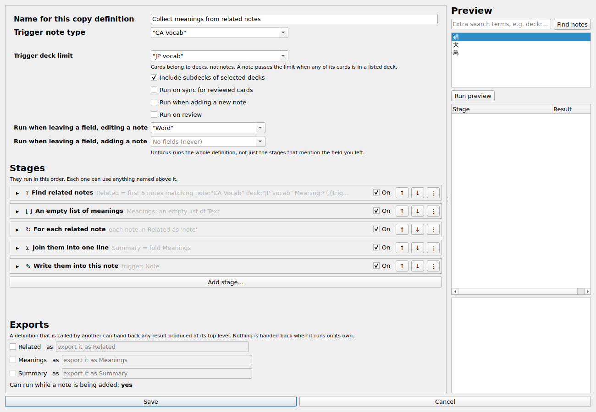

The definition in the picture finds notes related to the one being edited, collects their
*Meaning* fields, joins them into one line and writes that line into the trigger note's
*Note* field. It is [`collect-meanings.json`](docs/examples/collect-meanings.json), and
[section 4](#4-a-walkthrough) builds it one stage at a time.

## 2. Install and setup

The addon is not on AnkiWeb. Install its `.ankiaddon` file with **Tools → Add-ons → Install
from file...**, or by opening the file with Anki, and restart Anki. Its source is at
[github.com/jhhr/anki_addons](https://github.com/jhhr/anki_addons).

Once it is installed, open the card browser. **Edit → Copy anywhere...** (by default
`Ctrl+Shift+C`) opens the list of definitions:

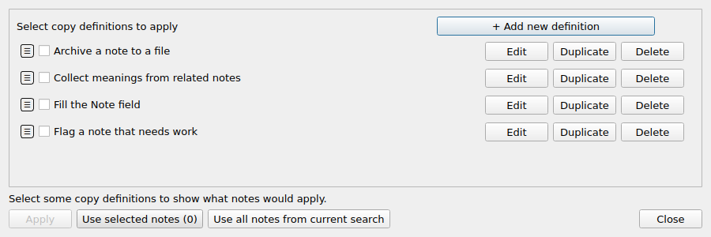

From here you add, edit, duplicate and delete definitions, and you run them: tick the ones
you want, then **Use selected notes** or **Use all notes from current search**, and
**Apply**. To run a single definition without opening this dialog, right-click a selection
in the browser and pick it from the **Copy anywhere** submenu.

Two things are set in Anki's own addon configuration screen (Tools → Add-ons → Config):

| key | what it is |
| --- | --- |
| `copy_fields_shortcut` | the shortcut for **Copy anywhere...**, `Ctrl+Shift+C` by default |
| `log_level` | how much a run records: `error` (the default), `warning`, `info`, `debug` |

`copy_definitions` in that same file holds the definitions themselves. It is readable, and
the examples in `docs/examples/` can be pasted into it, but the editor is easier.

### Custom scheduling, for "Run on sync for reviewed cards"

A definition that runs for cards you reviewed on another device needs the reviews flagged as
they happen, which only the scheduler can do. Open any deck's options, **Advanced → Custom
scheduling**, and add:

```
customData.again.fc = 0;
customData.hard.fc = 0;
customData.good.fc = 0;
customData.easy.fc = 0;
```

That marks each answered card unprocessed. The sync sweep picks up the marked cards, runs
the definitions that asked for it, and clears the mark. Nothing else needs this.

## 3. The model

### What makes a definition run

At the top of the editor you name the definition and say which notes it considers: a
**trigger note type** (one or more) and, optionally, a **trigger deck limit** — cards belong
to decks, so a note passes the limit when any of its cards is in a listed deck. That
filtering happens before any stage runs.

Then you tick when it should run. A definition can have any number of these, or none at all,
in which case you run it by hand from the browser:

- **Run when adding a new note** — when the note is added through the Add dialog,
  AnkiConnect, or anything else calling `col.add_note()`. [Section 5](#5-adding-notes) is
  about what a definition may do at that moment.
- **Run when leaving a field, editing a note** and **Run when leaving a field, adding a
  note** — pick the fields. Leaving one of them runs the whole definition, not just the
  stages that mention it.
- **Run on review** — after you answer a card, for its note.
- **Run on sync for reviewed cards** — reviewed cards are gathered at sync time and the
  definition runs over them then, including the ones you reviewed on another device. This
  needs the scheduling setup above. With *Run on review* on as well, the desktop runs it on
  review and the sync sweep leaves those cards alone, so nothing is done twice.

### The stages

Stages run top to bottom. A stage that produces a value gives it a name, and every stage
below it can use that name. There are fourteen kinds, and **Add stage...** offers them all
except *Edit Card*, which appears only where an earlier stage has named a card for it to act
on:

| stage | what it does |
| --- | --- |
| **Variable** (`variable`) | computes one value and names it |
| **Query Notes** (`note_query`) | an Anki search, producing a list of notes |
| **Query Cards** (`card_query`) | the same, producing a list of cards |
| **Edit Note** (`edit_note`) | writes fields, tags and card actions to one named note |
| **Edit Card** (`edit_card`) | card actions on one named card |
| **Read File** (`read_file`) | reads one file from the media folder, as text |
| **Write File** (`write_file`) | replaces one file in the media folder |
| **List** (`list_variable`) | declares an empty list |
| **Store** (`store`) | appends one value to a list |
| **Loop Over Notes** (`for_each_note`) | runs its body once per note in a list |
| **Loop Over Cards** (`for_each_card`) | runs its body once per card, binding the card's note too |
| **Reduce** (`reduce`) | joins a list into one text, or folds it with an expression |
| **Condition** (`condition`) | runs exactly one of its two branches |
| **Call Definition** (`call_definition`) | runs another definition and keeps what it hands back |

A query stage also says how many of the matches to take, in what order, and what to do when
nothing matches. Loops bind the position (`index`, one-based) and the total (`count`)
alongside each item. A name declared inside a loop body or a branch is gone when that block
ends — which is why collecting anything out of a loop means a **List** before it, a **Store**
inside it, and a **Reduce** after it.

<details>
<summary>One editor per stage type</summary>

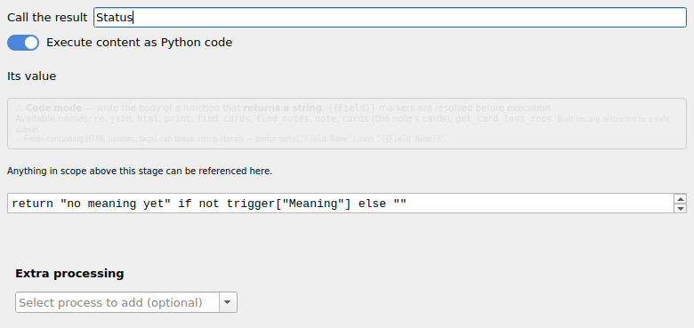
`variable` — computes one value and names it.

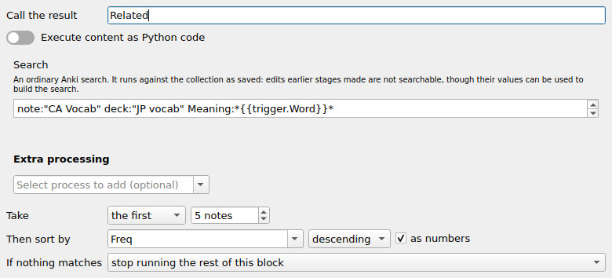
`note_query` — an Anki search, with how many of the matches to take and in what order.

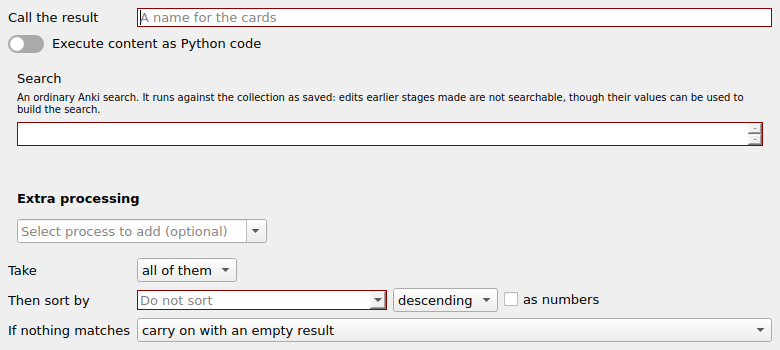
`card_query` — the same, counting cards instead of notes.

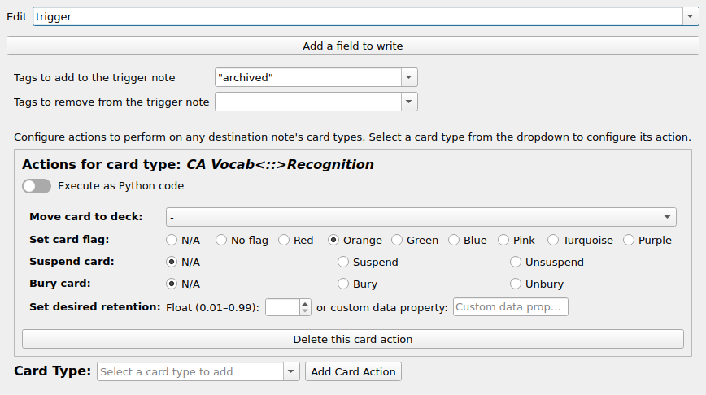
`edit_note` — fields, tags and card actions on one named note.

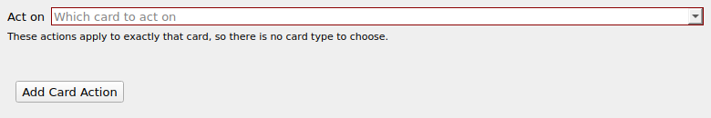
`edit_card` — card actions on one named card, with no card type to choose.

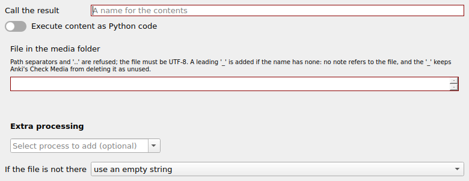
`read_file` — one media file's contents, named.

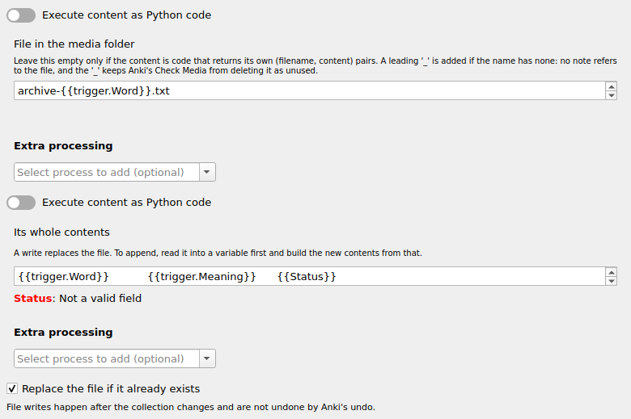
`write_file` — replaces one media file.

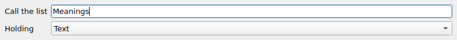
`list_variable` — declares an empty list.

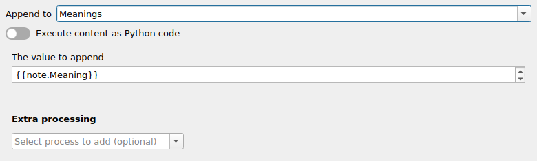
`store` — appends one value to a declared list.

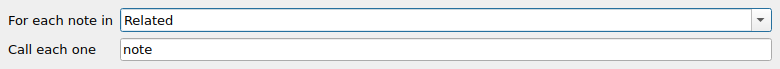
`for_each_note` — a pass per note in a note list.

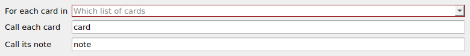
`for_each_card` — a pass per card, binding the card's note too.

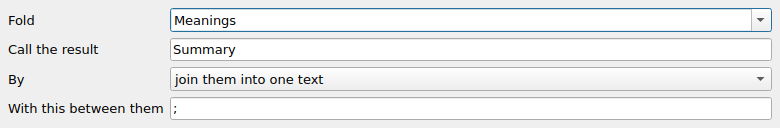
`reduce` — joins a list into one text, or folds it with an expression.

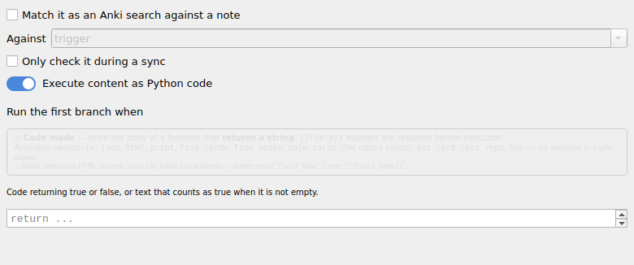
`condition` — runs exactly one of its two branches.

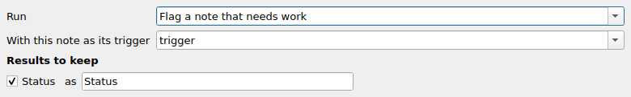
`call_definition` — runs another definition and keeps the results it exports.

</details>

### Values

Everywhere a definition computes something — a field's new content, a search, a filename, a
condition — you get the same editor. Left as text, it is interpolated:

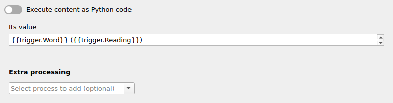

References name what they read: `{{trigger.Word}}` is a field of the note the definition ran
for, `{{note.Meaning}}` a field of the note a loop is on, `{{card.deck_name}}` a card value,
and a bare `{{Summary}}` is a result some stage above produced. The right-click menu lists
exactly what is in scope at that stage — a loop's note is offered inside the loop and not
above it — and anything you type that is not on the menu is marked in red underneath. Lists
are never offered: turning several values into one piece of text is a decision, so a
**Reduce** or some code has to make it.

Turn on **Execute content as Python code** and the box becomes the body of a function that
returns the value instead:

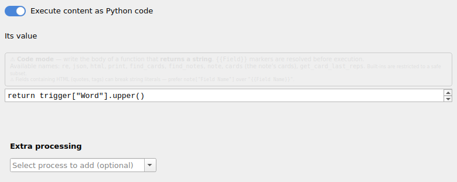

Code gets read-only views of the notes and cards in scope, plus `find_notes`, `find_cards`,
`get_note` and `get_card`. `note` is the note the stage is on (inside a loop, the loop's
note) and `cards` are that note's cards. Assigning through one of those views raises: every change a
definition makes goes through a stage, which is what keeps it visible to the preview and to
the undo entry. After either form, the optional **Extra processing** chain runs — the same
regex and text processes as before.

### Inside an Edit Note stage

One **Edit Note** stage names the note it writes to and can do three things to it: write
fields, add and remove tags, and act on its cards.


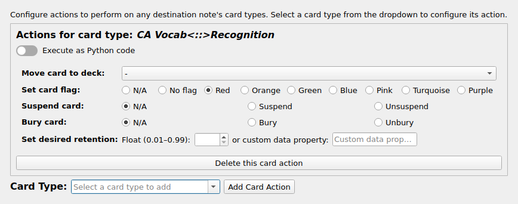

A card action picks one card type of that note and moves the card to a deck, flags it,
suspends or buries it, sets its desired retention — or runs Python. (**Edit Card** is the
same thing for a card a query or a loop already named, so it has no card type to pick.)

### Handing values to another definition

A definition that is called by another can hand back any result produced at its top level.
Tick it in the **Exports** panel at the bottom of the editor and give it the name the caller
will see:

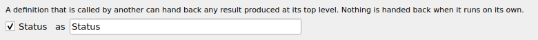

[`flag-and-export.json`](docs/examples/flag-and-export.json) exports a result called
`Status`; [`archive-to-a-file.json`](docs/examples/archive-to-a-file.json) calls it and binds
that export, then writes it into a file. A called definition is otherwise sealed off: it gets
its trigger note and nothing else of the caller's — no variables, no lists, no loop
positions — and hands back only what it exports. Definitions that call each other in a circle
are refused, and so is a chain more than 32 deep.

## 4. A walkthrough

[`collect-meanings.json`](docs/examples/collect-meanings.json) fills the trigger note's
*Note* field with the meanings of the other notes whose *Meaning* mentions this note's word.
It runs when you leave the *Word* field of a `CA Vocab` note in the *JP vocab* deck. Here it
is, a stage at a time.

**1. Find the notes.** A **Query Notes** stage runs
`note:"CA Vocab" deck:"JP vocab" Meaning:*{{trigger.Word}}*`, takes the first five by *Freq*
descending, and calls the result `Related`. If nothing matches, the rest of the definition is
skipped, so nothing overwrites the field with an empty line.

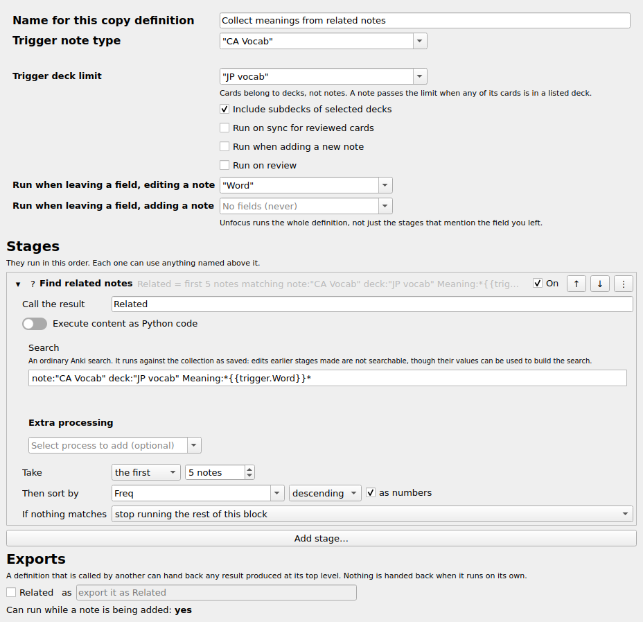

**2. Make somewhere to put the meanings.** A **List** stage declares an empty list of text
called `Meanings`. It is outside the loop because a name declared inside a loop does not
survive the pass that declared it.

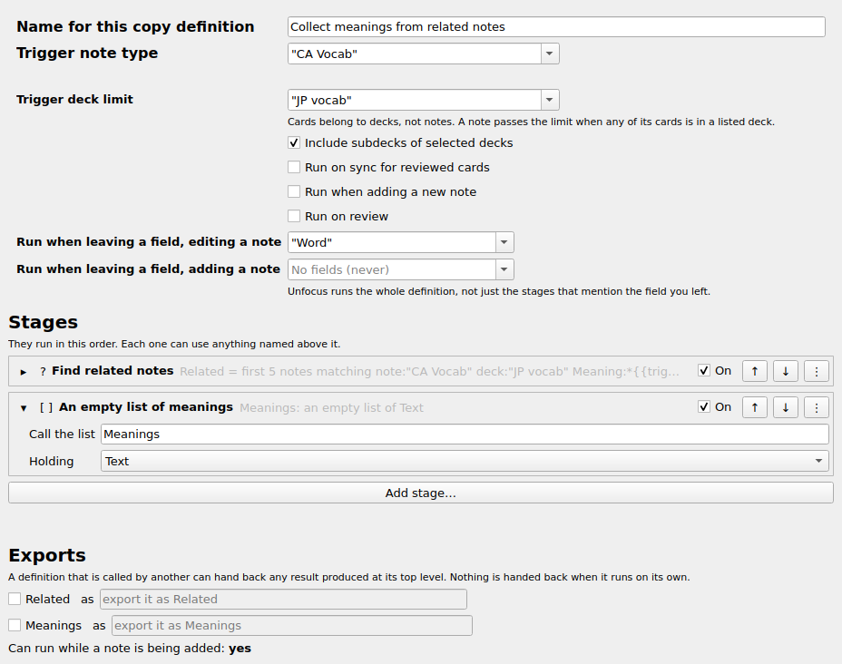

**3. Go through them.** A **Loop Over Notes** stage walks `Related`, calling each one `note`,
and a **Store** stage in its body appends `{{note.Meaning}}` to `Meanings`.

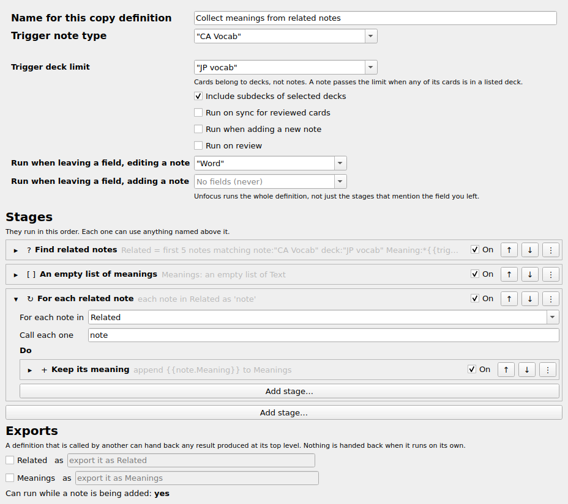

**4. Join them.** A **Reduce** stage joins `Meanings` with `; ` into one piece of text called
`Summary`.

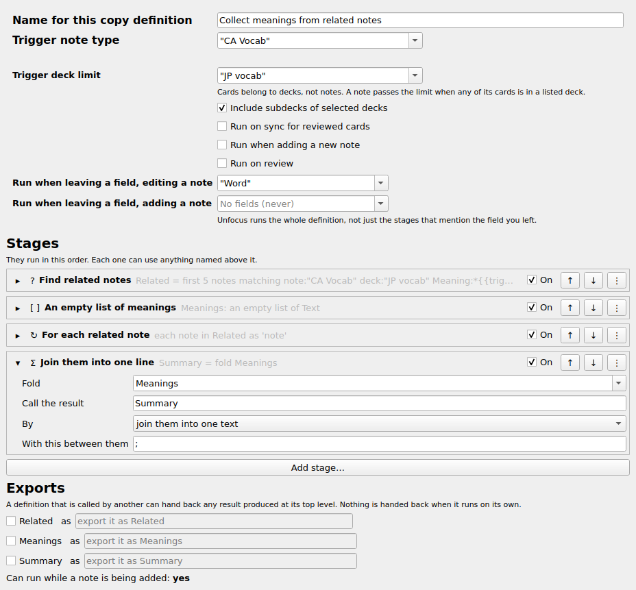

**5. Write it.** An **Edit Note** stage on `trigger` writes `{{Summary}}` into *Note*.

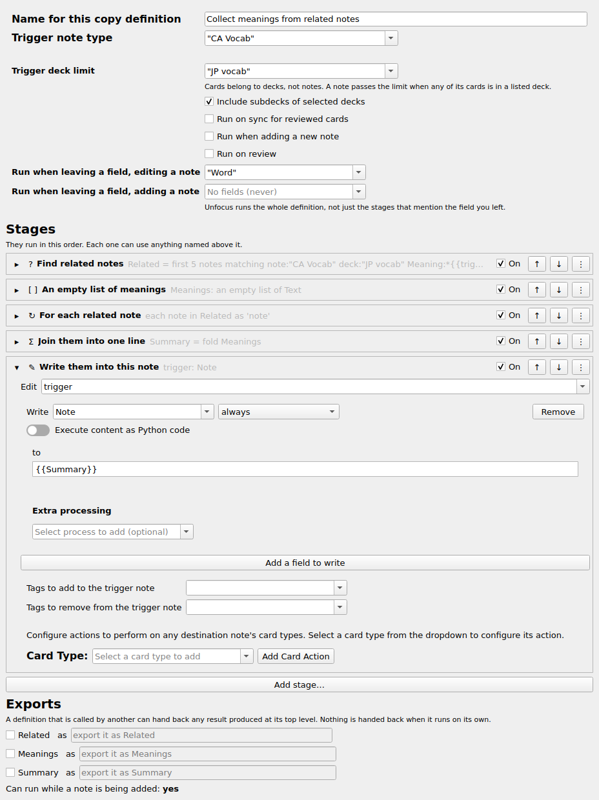

Nothing is written to the collection until every stage has run. Press **Run preview** on the
right at any point to see what this definition would do to one real note, without doing it.

## 5. Adding notes

While a note is being added you can still press Escape, and the note never existed. So a
definition that runs at that moment may edit **only the note being added** — its fields and
its tags. Anything else it did would survive a cancelled add and there would be nothing to
undo it.

That gives three rules:

- **Its own cards cannot be reached.** The note has no cards until the add goes through, so a
  card action on it has nothing to act on. It is skipped, a line is written to the log, and
  nothing runs it later. This does not hold the definition back: a skip leaves nothing
  behind.
- **Another note, another card, or a file is out of bounds.** An **Edit Note** on any note
  but the trigger, an **Edit Card**, a card action on another note's cards, a **Write File**,
  or a call to a definition that does one of those — any one of them means the definition
  cannot run as part of an add.
- **Reading is always fine.** Reading the trigger's card values on a note that has no cards
  answers with a new card's defaults rather than failing, exactly as it always did.

A **search condition** on the note being added cannot ask the collection, which does not
have the note yet. It is judged against the note itself instead — its fields, tags and note
type as they stand, and for `deck:` the deck it is being added to — with Anki's own rules,
so it gives the answer Anki would give once the note is saved. A term that needs something a
new note does not have yet — cards, review history, an id, such as `is:due`, `card:`,
`prop:`, `rated:`, `flag:`, `nid:`, or a regular-expression search — fails the definition,
and the log names the term. (Format 1 searched the collection for a note with id 0, so the
note being added never matched.)

If a definition fails, is refused, or its condition does not match, the note it ran for is
left exactly as it was before that definition started — the note being added here, the note
being edited in the editor — so the Add dialog adds it without half-made edits. What earlier
definitions wrote to it stays.

The editor says where a definition stands, under the stage list: *Can run while a note is
being added: **yes** / **no***, with amber notes when there is something to say. They are
independent — a definition can earn several, one or none — and none of them stops you
saving.

The first is about what is **impossible**:

> The card action on *&lt;stage&gt;* needs a card the note being added does not have yet, so
> it will not run for that note, and nothing runs it later.

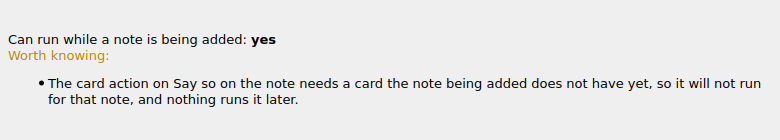

The second is about what is **forbidden**, and names the stages responsible after "Because
of". With *Run when adding a new note* on, it reads:

> This definition runs when a note is added, and it reaches beyond the note being added —
> another note, a card that already exists, or a file. That work happens after the add rather
> than as part of it, with its own undo entry for the notes and cards it touches.

If the definition only runs on leaving a field while adding, the same message instead says
that it is skipped there, and that turning on *Run when adding a new note* is what gives it a
moment to run in.

There is no picture of the forbidden note on its own — it is the second bullet here, below
the impossible one, in a definition that earns both:

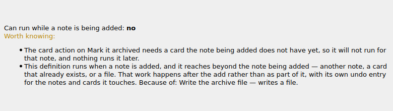

A third kind names a search condition, on the trigger, that uses a term the note being
added cannot answer, and says the definition will fail there.

## 6. What the editor checks

Every edit re-reads the whole definition, and **Save** is disabled while anything is wrong.
What is wrong is listed under the stage list, each item with the path of the stage it belongs
to, and the stage's own row says it too.

The checking is about names and shapes: a result whose name is missing, reserved, or shadows
one already in scope; a field read through something that is not a note or a card; a list
interpolated into text, or stored into something that is not a list; a **Condition** whose
predicate is empty; an export that a skip earlier in the definition could leave unset; and
definitions calling each other in a circle, which is checked across the whole config and
names the whole circle.

How a reference is *spelled* is the value box's own job. Anything you type there that the
menu does not offer is marked in red underneath as you type:

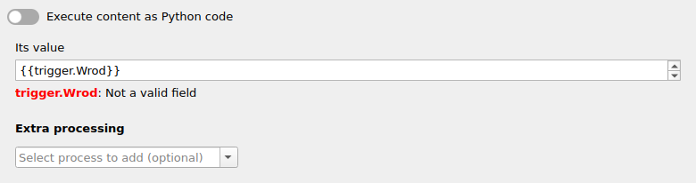

The same check runs when the definition is re-read: a name nothing in scope answers to, and
that is not a value the run supplies (`index`, `count`, ...), is listed as a problem and
blocks **Save**. A definition that reaches the run with one anyway -- written by hand, say --
fails at that stage, and the log names the reference.

Alongside that, saving records what each definition *does* — whether it edits the trigger
note, other notes, the trigger's cards, other cards, whether it reads or writes files,
searches the collection, or calls another definition — following calls into the definitions
they call. That record is what the hooks read at run time, so it is recomputed for every
definition whenever any one of them is saved, added or deleted, not just for the one that
changed. Its most visible part is the add-note answer in [section 5](#5-adding-notes).

The right-hand half of the editor is the preview. Pick one of the notes the triggers would
consider and press **Run preview**: the definition runs for real — real searches, real code,
called definitions and all — but nothing is committed and nothing reaches the media folder.
The trace lists every stage in the order it ran, with a pass per iteration inside loops, and
selecting one shows what it could see, what it produced and what it would have changed.

None of this is a substitute for the log. A run that has something to report writes a file
under the addon's `user_files/logs/`, named after what triggered it; a run you started from
the browser opens it when it is finished. At the default `log_level` of `error` a clean run
writes nothing at all and no file is created. Raise it to `info` or `debug` when you want to
see every stage of every note. The newest fifty files are kept.

## 7. Files

**Write File** replaces one file in your collection's media folder, and **Read File** reads
one back. Both take a filename as a value like any other, so it can be built from the note.
[`archive-to-a-file.json`](docs/examples/archive-to-a-file.json) names its file
`archive-{{trigger.Word}}.txt`, so for the word *neko* it writes `_archive-neko.txt`.

What to know before using them:

- Every file name starts with `_`: one is added to a name that has none, for reading as for
  writing, and in the error that says a file is missing. No note refers to these files, and
  the `_` is what keeps Anki's Check Media from deleting them as unused.
- Files are written as UTF-8, with no byte-order mark and no newline translation.
- A filename resolves inside the media folder. A path separator or a `..` segment is refused.
- There is no append. Read the file, build the new content, write it back with *overwrite*.
- A stage can be told to skip if the file exists, or to refuse to overwrite. Both questions
  count a file an earlier stage of the same run has queued as already there.
- File writes happen after the collection changes and are **outside Anki's undo**. Undoing
  the operation puts the notes and cards back; it does not put the files back.
- If a write fails — a full disk, a read-only folder — the run stops there and reports
  failure naming the file. The note and card changes it had already made are kept, the files
  written before it stay written, and that file and the ones queued after it are not
  attempted.

## 8. Migrating from format 1

Definitions written for the older CopyAnywhere are converted to stages the first time Anki
starts after the update. There is nothing to do by hand, and nothing to keep switched on. The
conversion is all or nothing: if any definition cannot be converted, none of them are, the
reason is printed, and the next start tries again — so a definition you can still open and
fix by hand is never dropped from the config.

Your originals are kept. Before converting anything, the addon copies the old definitions to
`pre_stage_migration_copy_definitions` in its configuration and never touches that key again.
They are there to read, and to convert again: copy them back over `copy_definitions`, set
`version` to `0.2.0`, and the next start migrates them afresh.

A few things change on purpose — note selection searches notes rather than cards, the
`Least_reps` selection becomes `random`, files stop translating newlines on Windows — and
[`docs/staged-definitions.md`](docs/staged-definitions.md#what-migration-changes-on-purpose)
lists them all. What does *not* change is a definition the old version refused to run. A
selection it could not read still selects nothing, and says so, until you tell it otherwise:

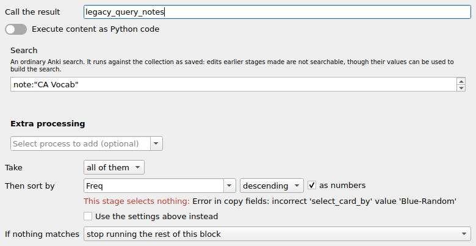

The references inside converted values are rewritten as part of the conversion. Format 1
named a note's fields with no note in front of them — `{{Word}}`, `{{__Dest__Word}}`,
`{{Recognition__Card_Due}}` — and left it to the executor to guess which note that was. The
conversion knows which note each value read, so it writes the name in: `{{trigger.Word}}`,
`{{note.Word}}`, whichever binding the old definition would have used. Nothing afterwards
speaks the old spelling, in text or in code; a converted definition reads like one you wrote
yourself, and the editor edits it like one. A reference that names nothing is not quietly
skipped any more either — on the trigger note the editor refuses to save it, and anywhere
else the stage fails and the log says which name it was.

**The one thing to check by hand** is values written as Python code. Their references are
rewritten the same way, but the code around them now runs as current code: `note` is the
note the stage is on — inside a loop, the note the loop is on — and `cards` are that note's
cards, every other binding in scope is there under its own name, and the cards are
read-only views with fewer properties than before. In a converted *Source to destinations*
definition that moves `note` from the note the definition ran for to the note being written.
Open each converted definition that has **Execute content as Python code** ticked, read what
the code does, and run the definition on one note before you let it loose on a selection.
The next section says exactly what changed where; it is written to be handed to an AI agent
along with your config.

### For an AI agent: rewriting converted code

You have been asked to update a user's converted CopyAnywhere definitions where the
conversion could not. Only Python code can need it: a value whose `"mode"` is `"code"`, and a
card action with `"use_code": true`. Text values, searches and copy conditions were converted
completely, and format 1 had no code form of a search or a condition, so leave those alone.
Leave the `{{...}}` references inside code alone too: the conversion already rewrote them
(`{{Word}}` to `{{trigger.Word}}`, `{{__Dest__Word}}` to `{{note.Word}}`, and so on), and
they are substituted into the code as text before it runs, as in format 1. What you may have
to change is the Python around them. Change as little as you can.

**Where things are.** The addon config (Tools → Add-ons → CopyAnywhere → Config, or the
`config` key of `meta.json` in the addon's folder, edited with Anki closed) holds:

- `copy_definitions`: the format-2 definitions, which are what runs. The full specification
  is [`docs/staged-definitions.md`](docs/staged-definitions.md). Do not edit `effects`; it is
  derived.
- `pre_stage_migration_copy_definitions`: the format-1 originals, as they were before the
  conversion. Written once and never touched again; do not edit it. Compare every piece of
  code you change with its original here. A converted definition keeps its original's
  `guid`, and so does the stage made from each field write, file write and variable; the
  stages the conversion invented have guids `<definition guid>::<role>`.

| format-1 code | where it is now |
| --- | --- |
| `field_to_field_defs[i].copy_as_code` | *Within note*, *Source to destinations*: `fields[i].value.code` of the `edit_note` stage. *Destination to sources*: `value.code` of the `store` stage `<guid>::join-store-<n>` (`n` counts the field writes from 1); the write itself now reads the joined `{{legacy_joined_<n>}}` |
| `field_to_file_defs[i].copy_as_code` | `content.code` of the `write_file` stage with that def's guid |
| `field_to_variable_defs[i].copy_as_code` | `value.code` of the `variable` stage with that def's guid, at the top |
| `card_actions[i].action_code` | the same action, unchanged, in the `edit_note` stage's `card_actions` |

The shapes: *Within note* is one `edit_note` on `trigger` and the file writes after it.
*Source to destinations* is a `note_query` into `legacy_query_notes` and a `for_each_note`
over it whose item binding is `note`, holding the `edit_note` on `note` and the file writes.
*Destination to sources* is the same query, then per field write a list, a loop (item
`note`) with the `store`, and a join, then the `edit_note` on `trigger`, and per code file
write a loop (item `note`) holding it. The variables come first; a copy condition wraps
everything after them.

**What the names mean.** Format-1 field, file and variable code got one note, `note`: the
note the value was read from. Format 2 code gets every binding in scope under its own name
(`trigger`, each variable, a loop's `note`, `index` and `count`, `legacy_query_notes`),
plus `note`, `cards` and `destination`, the helpers `find_notes` and `find_cards` (id lists
from the saved collection), `get_note(id)` and `get_card(id)`, and `get_card_last_reps`,
`re`, `json`, `html` and `print`, as format 1 did. `trigger` is always the note the definition
runs for.

| code in | `note` in format 1 | `note` now | `destination` now | `index`, `count` |
| --- | --- | --- | --- | --- |
| a variable, any shape | the trigger | the trigger | the trigger | not defined |
| *Within note*, field write | the trigger, as the stage started | the same | the same | not defined |
| *Within note*, file write | the trigger before the field writes | the trigger after them | the trigger | not defined |
| *Source to destinations*, field write | **the trigger** | **the note being written**, as the stage started | the note being written | its place among the found notes, their number |
| *Source to destinations*, file write | **the trigger** | **the found note the loop is on** | the trigger | the same |
| *Destination to sources*, field write | the source note | the source note | the trigger | its place among the sources, their number |
| *Destination to sources*, file write | the source note | the source note | the trigger | the same |

`cards` is the cards of whatever `note` is, as it was in format 1, so it changed exactly
where `note` did.

**The trap is *Source to destinations*.** Its edits run inside a loop whose item is called
`note`, and `note` means the loop's note there. Format-1 code that read the note the
definition ran for as `note` now reads the found note it is writing: `return
note['Word'].upper()` now writes each destination's own *Word*, uppercased, and a file write
names and fills its file from the destination too. Nothing fails; the values are just wrong.
Rewrite `note` to `trigger` and `cards` to `trigger.cards` in that code. *Destination to
sources* is not affected: it loops over the source notes with the same item name, and format
1 ran that code once per source note with that note as `note`, so the name still means the
same note. *Within note* and variables are not affected either, except that a Within-note
file write now sees the field writes made just before it.

Before, a *Source to destinations* write into each found note's *Meaning*:

```python
word = note['Word']
return word.upper() + ' / ' + '{{__Dest__Meaning}}'
```

After the conversion, which rewrote the reference but not the Python, so `word` is now the
destination's own *Word*:

```python
word = note['Word']
return word.upper() + ' / ' + '{{note.Meaning}}'
```

What it should be:

```python
word = trigger['Word']
return word.upper() + ' / ' + '{{note.Meaning}}'
```

**Other differences in field, file and variable code.**

- Notes and cards are read-only views, as before: assigning to a field raises. A note has
  `note['Field']`, `keys()`, `values()`, `items()`, `in`, `id`, `guid`, `mid`,
  `note_type_id`, `note_type_name`, `is_cloze`, `tags`, `has_tag()`, `mod`, `usn`,
  `sort_field` and `cards`.
- A card has `id`, `nid`, `note`, `did`, `odid`, `deck_id`, `deck_name`,
  `original_deck_name`, `ord`, `template_name`, `type`, `queue`, `due`, `odue`, `ivl`,
  `factor`, `ease`, `reps`, `lapses`, `left`, `flag`, `custom_data`, `desired_retention`,
  `stability`, `difficulty`, `mod`, `suspended` and `buried`, and nothing else. Gone:
  `created`, `first_review_time`, `latest_review_time`, `average_review_time`,
  `total_review_time` and anything else a raw Anki card had (`card.note()`,
  `card.template()`). `card.note` is a property, and `template_name` no longer adds the
  cloze number. For the review times, put a card-value reference in the code as a string,
  such as `'{{trigger.Recognition__Card_First_Review}}'`.
- A variable can use the variables above it by name. In format 1 it could not.
- A list, tuple, note or card that code returns is no longer turned into text. A *Within
  note* or *Source to destinations* field write fails on one, and a variable keeps it,
  which a `{{...}}` reference to the variable then refuses; format 1 wrote its `str()` in
  both. Return `str(...)` where the text is what was meant. (A *Destination to sources*
  field write still joins each value's `str()`.)

**Card-action code needs no change.** It runs through the same function as in format 1,
with the same names: `note` is the note the `edit_note` stage writes (a found note in
*Source to destinations*, the trigger otherwise), after that stage's field writes, as a view
offering only `note['Field']` and `note.keys()`, and `cards` is that note's cards read from
the collection, as format 1's card views (`created` and the review times are still there).
It also gets `find_notes`, `find_cards`, `get_card_last_reps`, `re`, `json`, `html` and
`print`. It gets no `trigger`, `destination`, variables, `index` or
`get_note`, `{{...}}` in it is not substituted, and it runs once per card of the card type
it names without being told which card.

**Checking the result.** Ask the user to open each definition you changed (browser, **Edit
→ Copy anywhere...**). The editor re-checks the `{{...}}` references, though not the Python,
and will not save a definition with a broken one. Then pick one trigger note in the preview
pane on the right and press **Run preview**. For *Source to destinations*, pick one whose
search finds at least one note. Selecting the `edit_note` stage in the trace, once per loop
pass, shows which note it would change and how; a `write_file` stage shows the file's name.
A code error, with its traceback, is shown under the summary and on the stage it failed in.
Nothing is committed and no file is written.

## Where the details are

| | |
| --- | --- |
| [`docs/staged-definitions.md`](docs/staged-definitions.md) | the specification: the shape of a definition, every rule, the editor and the preview |
| [`docs/examples/`](docs/examples) | the four definitions this file uses, as they are stored |

## Acknowledgments

- tatsumoto-ren at [Ajatt-tools](https://github.com/Ajatt-Tools) for `kana_conv.py`
- piazzatron for their [Smart Notes](https://ankiweb.net/shared/info/1531888719), where the
  [text interpolation code](https://github.com/piazzatron/anki-smart-notes/blob/main/src/prompts.py#L138)
  started
- [ijgnd](https://github.com/ijgnd) for their
  [Additional Card Fields](https://ankiweb.net/shared/info/744725736), whose card data
  gathering is implemented here
